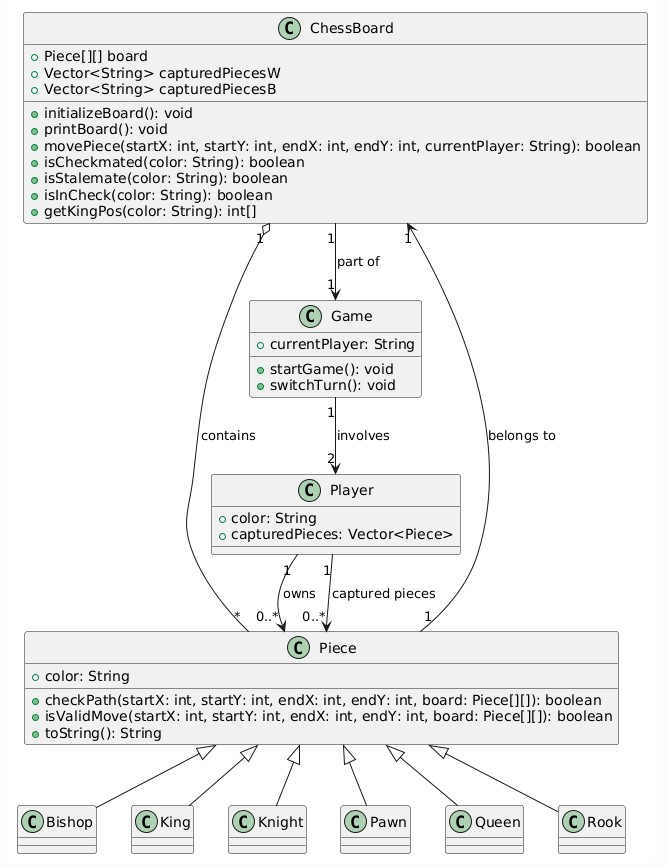

 Chess Game: Phase 3 Submission

 Team Information
- Team Name: VOGS
- Team Members: Gabriele Saldaña, Steven Conde, Om Patel, Vinny Rose
- Course: CS3354-003 - Fall 2024

 - Project Overview
This project is a fully functional, GUI-based Chess Game developed in three phases:
1. Phase 1: Console-based chess logic and move validation.
2. Phase 2: Graphical User Interface (GUI) with dynamic board updates.
3. Phase 3:Integration of backend logic with the GUI and implementation of full chess rules.

The game supports player vs. player functionality with proper chess rules, including move validation, check and checkmate detection, and dynamic GUI updates.

Features
Core Functionality
- Move Validation: Validates moves based on chess rules.
- Captured Pieces Display : Shows pieces captured by each player.
- Check and Checkmate Detection: Alerts players of "Check" status and ends the game with a "Checkmate" message.
- Stalemate Detection : Recognizes and ends the game if no valid moves are available but the king is not in check.

GUI Highlights
- Interactive 8x8 chessboard with alternating light and dark squares.
- Drag-and-drop functionality for moving pieces.
- Click-and-move functionality for players preferring a simpler interaction style.
- Visual representation of captured pieces and current game state.

Additional Features
- User-friendly prompts for player turns.
- Detailed feedback for invalid moves.
- Seamless integration between the console-based backend and GUI.

 Screenshots

 Initial Game Setup:

 Mid-game Move Example:

Endgame Checkmate Notification:

How to Run
1. Clone the repository: 
https://git.txstate.edu/gih34/chess-gui.git

2. Navigate to the project directory:

cd chess-game

3. Compile the code
javac *.java

4. Diagram:https://ibb.co/80Pbv94

5. Run the game:

java ChessGame

Checklist of Achieved Features
 GUI Chessboard - Done
 Move Validation - Done
 Checkmate Detection - Done
 Captured Pieces Display - Done
 Stalemate Detection- Done
 Full Console Integration with GUI - Done

   
